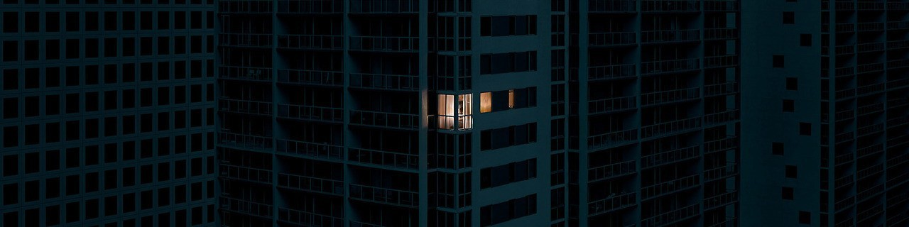

On this planet for **9612 days**.

# Welcome To My Life 

### 😄 About

Currently, I am juggling between my dream and managing my life. I am pursuing FinTech in Computer Science.

### 💻 Study and Work

I love to explore new technologies. I use the following technologies to create my ideas. I try to automate almost everything that comes my way as it helps to improve my creativity and make new ideas.

- **Python** - Almost Everywhere
- **Django** - Backend Development
- **Vue.js** - Front End Development

### 🎹 Music

Sometimes I decide to get away from tech life and move back into my music production life style. I have [Soundcloud channel](https://soundcloud.com/elex-stevelex), where you can listen to my own musics and also what I listen.

Last updated by Github Actions on {{last_updated}}.
